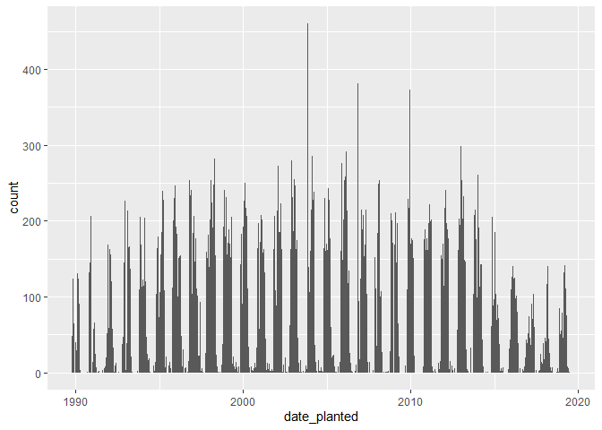
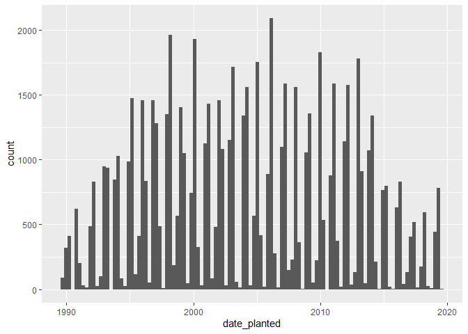
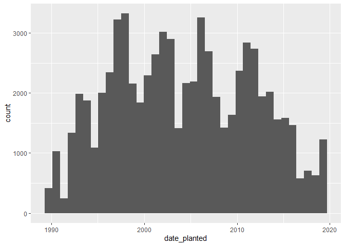
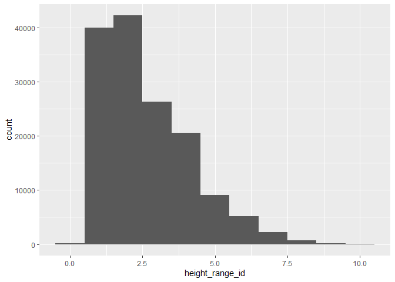
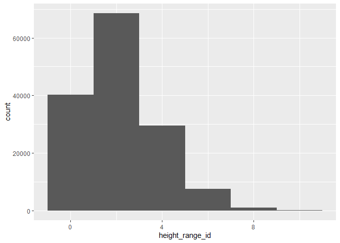
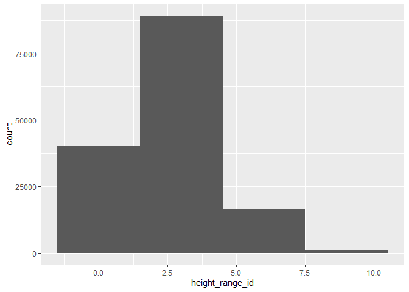

Assignment b1
================
Emily Brown

In the mini-data analysis assigment for Stat545A, I often repeated code
for making histograms with various bin widths for the same variable. I
think that it could be useful to make this into a function.

Loading required packages:

``` r
library(ggplot2) #ggplot is used within the function
library(datateachr) #the vancouver_trees dataset is in this package
library(dplyr)
```

    ## 
    ## Attaching package: 'dplyr'

    ## The following objects are masked from 'package:stats':
    ## 
    ##     filter, lag

    ## The following objects are masked from 'package:base':
    ## 
    ##     intersect, setdiff, setequal, union

``` r
library(commonmark)
library(testthat)
```

    ## Warning: package 'testthat' was built under R version 4.1.3

    ## 
    ## Attaching package: 'testthat'

    ## The following object is masked from 'package:dplyr':
    ## 
    ##     matches

Creating and documenting the quick_hist function:

``` r
#' @title Quick histogram
#' 
#' @description This function can be used to create quick histogram plots with specified bin widths. It is useful for comparing which bin width is best to use for a variable.
#' 
#' @param x Numeric column. I named this x because it will be the x variable in the plot.
#' @param binwidth Number. I named this binwidth because it is descriptive and matches the ggplot syntax, so will not be confusing for users.
#' 
#' @return A ggplot.

quick_hist <- function(data, x, binwidth) {
  ggplot(data, aes({{ x }})) +
  geom_histogram(binwidth = binwidth)
}
```

Examples:

``` r
#Here I am comparing the histograms for date_planted at various bin widths
(quick_hist(vancouver_trees, x = date_planted, 10))
```

    ## Warning: Removed 76548 rows containing non-finite values (stat_bin).

<!-- -->

``` r
(quick_hist(vancouver_trees, x = date_planted, 100))
```

    ## Warning: Removed 76548 rows containing non-finite values (stat_bin).

<!-- -->

``` r
(quick_hist(vancouver_trees, x = date_planted, 300))
```

    ## Warning: Removed 76548 rows containing non-finite values (stat_bin).

<!-- -->

``` r
#And trying it out on height range:
(quick_hist(vancouver_trees, x = height_range_id, 1))
```

<!-- -->

``` r
(quick_hist(vancouver_trees, x = height_range_id, 2))
```

<!-- -->

``` r
(quick_hist(vancouver_trees, x = height_range_id, 3))
```

<!-- -->

To use testthat on graphical outputs, one must digest the plot that is
expected and the plot that the function generates, and test that both
are equal.

``` r
#Testing that the function throws an error when we pass it data that doesn't make sense
test_that("Error testing", {
  expect_error(quick_hist(x= letters, binwidth = 1))
})
```

    ## Test passed

``` r
#Making a subset for non-na values of date_planted in vancouver trees
nona_subset <-
  filter(vancouver_trees,
         is.na(date_planted) == FALSE)
#Testing that we don't get a warning when there are no NA's
test_that("Expect no warning when there are no NA's", {
  expect_warning(quick_hist(nona_subset, x=date_planted, binwidth = 100), 
               NA)
})
```

    ## Test passed

``` r
#Testing that we get an error when we leave out the bin width column.
test_that("Leave out bin width", {
  expect_error(quick_hist(vancouver_trees, x= date_planted))
})
```

    ## Test passed
